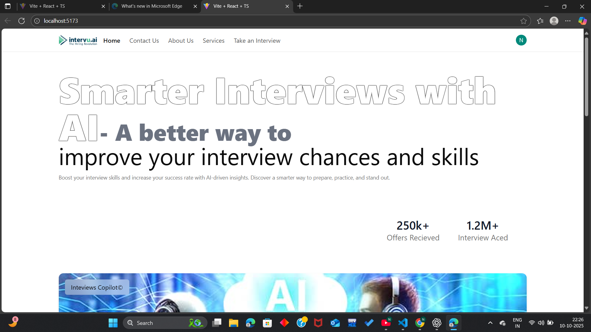

# React AI Mock Interview

React AI Mock Interview is an innovative web application designed to simulate real-world mock interviews using AI. With seamless user authentication, an intuitive interface, and integration with advanced AI, this project serves as an invaluable tool for interview preparation.

## Features

- AI-Powered Mock Interviews  
  Leverage Google Gemini AI to simulate realistic interview scenarios, evaluate responses, and provide personalized feedback.

- Seamless Authentication  
  User authentication is powered by Clerk, ensuring secure and efficient access control.

- Intuitive UI  
  Built with Shadcn UI, the application boasts a modern and responsive interface for a seamless user experience.

- Data Management  
  All user progress, interview analytics, and configurations are stored securely in Google Firebase Firestore.

- Dynamic Interview Customization  
  Customize interviews based on job roles, difficulty levels, and domains.

---

## Tech Stack

- Frontend: React.js
- Authentication: Clerk
- UI Framework: Shadcn UI
- Database: Google Firebase Firestore
- AI Integration: Google Gemini AI

## Key Features

- AI-Driven Insights
  Provides real-time feedback on your interview performance, highlighting strengths and areas for improvement.

- User-Friendly Dashboard
  Track your progress, access past interviews, and download detailed performance reports.

- Interactive Questionnaires
  Engage with diverse question types, including multiple-choice, scenario-based, and technical interviews.
